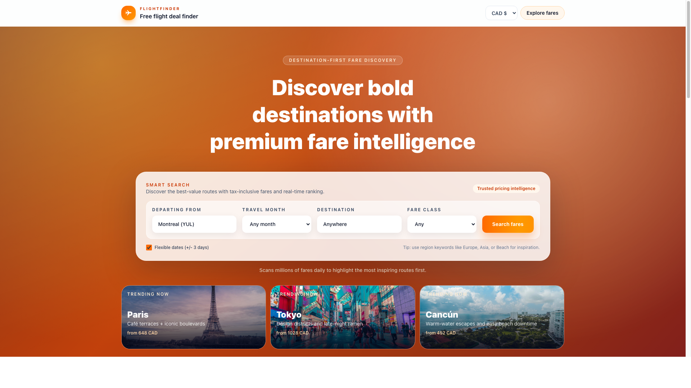

# FlightFinder

**A destination-first flight discovery platform built with Next.js, TypeScript, and Tailwind CSS.**

🔗 **Live Demo:** [flight-discovery.vercel.app](https://flight-discovery.vercel.app)



---

## Why I Built This

Traditional flight search tools are origin-destination focused. I wanted to flip that: **"What's the best value destination I can fly to this month?"**

FlightFinder ranks routes by value score (price vs. typical fare), deal quality, and routing efficiency—perfect for flexible travelers who care more about experience than specific cities.

---

## Tech Stack

- **Frontend:** Next.js 14, React, TypeScript, Tailwind CSS
- **Testing:** Playwright (visual regression), Vitest
- **Deployment:** Vercel (CI/CD with automatic preview deployments)
- **Data:** Custom fare ranking algorithm with mock data (API integration planned)

---

## Features

- **Destination-first search** with flexible dates (+/- 3 days)
- **Value scoring** (savings vs. typical fares)
- **Curated discovery sections:**
  - Best Value This Month
  - Weekend Escapes
  - Warm Weather Picks
  - Under $700
- **Mobile-responsive design** with modern UI/UX
- **Visual regression testing** to prevent UI regressions

---

## Development

```bash
# Install dependencies
npm install

# Run development server
cd frontend && npm run dev

# Run tests
npm test

# Run visual regression tests
npm run test:visual
```

---

## Project Structure

```
flight-discovery/
├── frontend/          # Next.js application
│   ├── src/
│   │   ├── app/       # App router pages
│   │   ├── components/# React components
│   │   └── lib/       # Utilities & data
│   └── tests/         # Playwright tests
└── README.md
```

---

## Roadmap

- [ ] Connect live flight API (Skyscanner, Amadeus, or Kiwi.com)
- [ ] User accounts & saved searches
- [ ] Price drop alerts via email
- [ ] Historical fare trends & price predictions
- [ ] Multi-city route optimization

---

## Technical Highlights

- **Fare ranking algorithm:** Custom scoring based on price deviation, deal quality, and routing efficiency
- **Visual regression testing:** Automated screenshot comparison to prevent UI regressions
- **Responsive design:** Mobile-first approach with Tailwind CSS
- **Type safety:** Full TypeScript coverage for maintainability

---

## Portfolio Context

This project demonstrates:
- **Full-stack development** (Next.js, React, TypeScript)
- **Product thinking** (destination-first UX innovation)
- **Testing discipline** (visual regression, unit tests)
- **Modern tooling** (Tailwind CSS, Vercel deployment)

Built as part of my transition into software development, showcasing practical skills in building production-quality web applications.

---

## License

MIT
