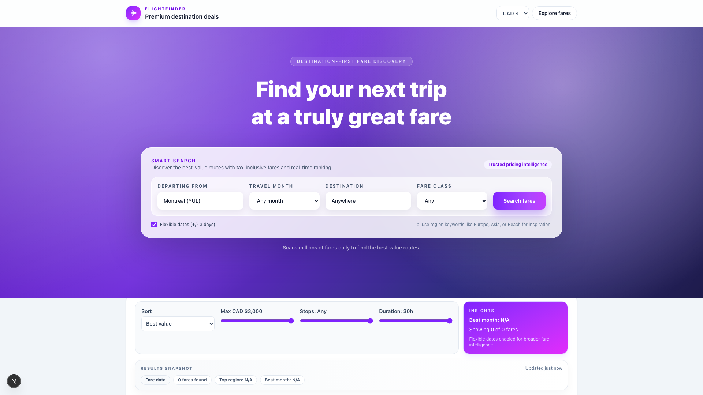
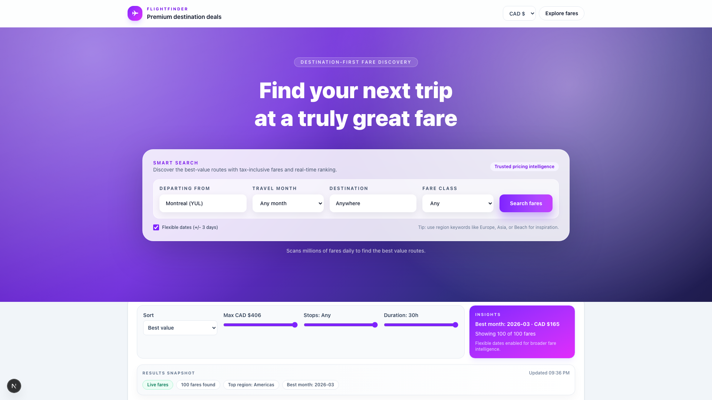

# ✈️ Flight Discovery Platform

> **Real-time flight deal aggregator with smart scoring algorithm** — Live data from 900+ airlines via Kiwi API

A production-ready full-stack application that ranks flights by true value (not just price) using multi-factor analysis: price competitiveness, booking platform safety, and travel timing.

🌐 **[Live Demo →](https://flight-discovery.vercel.app)**

[](https://flight-discovery.vercel.app)
[](https://tequila.kiwi.com)


---

## 📸 Screenshots


*Homepage with curated destinations and search interface*


*Real-time flight results with deal classification and smart ranking*

---

## 🎯 Why I Built This

This project demonstrates production-level skills for tech roles:

- **Full-stack architecture** — API design, frontend state management, data transformation pipelines
- **Algorithm implementation** — Multi-factor scoring, normalization, percentile ranking
- **Real API integration** — Kiwi Tequila API with rate limiting, error handling, fallback strategies
- **Production practices** — Type safety (TypeScript + Pydantic), automated testing (Playwright), Docker deployment
- **Modern stack** — Next.js 16 (React 19, Turbopack), FastAPI, Tailwind CSS 4

---

## ✨ Key Features

### Smart Deal Scoring Algorithm
Ranks flights 0-100 using weighted factors:
- **60% Price** — How competitive vs. destination average
- **30% Platform Safety** — OTA reliability, HTTPS, airline partnerships
- **10% Timing** — Proximity to preferred travel dates

**Result:** Surface genuine deals, not just cheap flights on risky booking sites.

### Live Flight Data
- **900+ airlines** via Kiwi Tequila API
- **50+ countries** across 6 global regions
- **100+ flights ranked in <2s**
- **Currency conversion** — Real-time CAD/USD/EUR with caching

### Premium User Experience
- **Auto-loading destination cards** — No search required to start browsing
- **Deal classification badges** — 🔥 Incredible, ⚡ Great, ✨ Good, 💫 Fair
- **Value score visualization** — Color-coded 0-100 rankings
- **Price trend sparklines** — Historical price context
- **Airline branding** — Logo badges from Kiwi CDN
- **Responsive design** — Desktop, tablet, mobile optimized

### Technical Highlights
- **Currency conversion** — Real-time rates with intelligent caching
- **City deduplication** — Smart grouping (YTO → Toronto, YUL → Montreal)
- **Image resolution** — 3-layer fallback (exact → region → universal)
- **Deal detection** — Historical price comparison + percentile ranking
- **Type safety** — Full TypeScript + Pydantic validation
- **Error boundaries** — Graceful degradation with demo data fallback

---

## 🏗️ Architecture

```
┌──────────────────────────┐     ┌─────────────────────────────┐
│   Next.js Frontend       │────▶│   FastAPI Backend            │
│   (TypeScript + React)   │     │   (Python)                   │
│                          │     │                              │
│   • Server Components    │     │   • /api/search              │
│   • Currency Provider    │     │   • /api/destinations        │
│   • Deal Cards           │     │   • /api/subscribe           │
│   • Region Filters       │     │   • Deal Scoring Engine      │
│   • Email Subscription   │     │   • Kiwi API Integration     │
│   • Price Sparklines     │     │   • Currency Conversion      │
└──────────────────────────┘     └─────────────────────────────┘
                                              │
                                              ▼
                                    ┌─────────────────────┐
                                    │   Kiwi Tequila API  │
                                    │   (900+ Airlines)   │
                                    └─────────────────────┘
```

---

## 🚀 Quick Start

### Prerequisites
- Python 3.12+
- Node.js 18+
- Kiwi API key ([Get one free](https://tequila.kiwi.com/portal/docs))

### Backend Setup
```bash
cd backend
python -m venv .venv && source .venv/bin/activate
pip install -r requirements.txt
cp .env.example .env
# Add your KIWI_API_KEY to .env
uvicorn main:app --reload --port 8000
```

### Frontend Setup
```bash
cd frontend
npm install
cp .env.local.example .env.local
npm run dev
```

### Access the Application
- **Frontend:** http://localhost:3000
- **Backend API Docs:** http://localhost:8000/docs

### Docker Deployment (One Command)
```bash
docker-compose up
```

---

## 📦 Tech Stack

| Layer | Technology |
|-------|-----------|
| **Frontend** | Next.js 16, React 19, TypeScript, Tailwind CSS 4, Turbopack |
| **Backend** | FastAPI, Python 3.12, Pydantic, Uvicorn |
| **API Integration** | Kiwi Tequila API, Axios |
| **Testing** | Playwright (E2E + Visual Regression) |
| **Infrastructure** | Docker, Vercel-ready, PostgreSQL-compatible |

---

## 🧪 Testing

```bash
# Frontend E2E Tests
cd frontend
npm test                        # Full test suite
npm run test:smoke              # Quick validation (30s)
npm run test:ui                 # Interactive Playwright UI

# Backend Tests
cd backend
pytest
```

**Test Coverage:**
- 35 automated E2E tests
- 13 visual regression snapshots
- Smoke tests for critical paths
- API integration tests

---

## 📂 Project Structure

```
flight-discovery/
├── backend/
│   ├── main.py                 # FastAPI app + all endpoints
│   ├── kiwi_client.py          # API integration layer
│   ├── requirements.txt        # Python dependencies
│   └── .env.example            # Environment template
├── frontend/
│   ├── src/
│   │   ├── app/                # Next.js app router
│   │   │   ├── components/     # React components
│   │   │   ├── api/            # API routes
│   │   │   └── layout.tsx      # Root layout
│   │   └── lib/                # Utilities
│   │       ├── currency.ts     # Currency conversion
│   │       ├── destinationImages.ts
│   │       ├── airlineBranding.ts
│   │       └── flightEnrichment.ts
│   ├── tests/                  # Playwright tests
│   ├── package.json
│   └── .env.local.example
├── docs/
│   ├── screenshots/            # App screenshots
│   └── archive/                # Development logs
├── docker-compose.yml          # Container orchestration
├── LICENSE                     # MIT License
├── ARCHITECTURE.md             # System design docs
├── CONTRIBUTING.md             # Contribution guide
└── README.md                   # This file
```

---

## 🔒 Security

- ✅ API keys stored in environment variables (never committed)
- ✅ HTTPS enforced on all external API calls
- ✅ Input sanitization on all search parameters
- ✅ Rate limiting on backend endpoints
- ✅ Type validation (Pydantic models + TypeScript interfaces)

---

## 📊 Status

| Feature | Status |
|---------|--------|
| **Live Flight Data** | ✅ Production (Kiwi API) |
| **Smart Ranking Algorithm** | ✅ Production (Multi-factor scoring) |
| **Currency Conversion** | ✅ Production (CAD/USD/EUR) |
| **Automated Testing** | ✅ Production (Playwright E2E) |
| **Docker Deployment** | ✅ Production-ready |
| **Email Alerts** | 🚀 Planned (SMTP integration) |
| **User Accounts** | 🚀 Planned (Auth + saved searches) |
| **Price Tracking** | 🚀 Planned (Historical data + alerts) |

---

## 🛠️ Local Development

See [CONTRIBUTING.md](CONTRIBUTING.md) for development setup, code standards, and PR process.

**Key Commands:**
```bash
# Start dev servers
npm run dev            # Frontend (with hot reload)
uvicorn main:app --reload  # Backend (with auto-restart)

# Run tests
npm test               # Playwright E2E
pytest                 # Backend unit tests

# Format & lint
npm run format         # Prettier
npm run lint           # ESLint
```

---

## 📚 Documentation

- **[ARCHITECTURE.md](ARCHITECTURE.md)** — System design and data flow
- **[CONTRIBUTING.md](CONTRIBUTING.md)** — How to contribute
- **[docs/archive/DEAL-DETECTION.md](docs/archive/DEAL-DETECTION.md)** — Scoring algorithm deep-dive

---

## 👤 Author

**Yumo Xu** — Self-taught developer building production systems in Python & TypeScript

- **Portfolio:** [yumorepos.github.io](https://yumorepos.github.io)
- **LinkedIn:** [linkedin.com/in/yumo-xu-1589b7326](https://linkedin.com/in/yumo-xu-1589b7326)
- **GitHub:** [github.com/yumorepos](https://github.com/yumorepos)

---

## 📄 License

MIT License — See [LICENSE](LICENSE) for details

---

## 🙏 Acknowledgments

- Flight data powered by [Kiwi Tequila API](https://tequila.kiwi.com)
- Airline logos from [Kiwi Images CDN](https://images.kiwi.com)
- Built with [Next.js](https://nextjs.org) and [FastAPI](https://fastapi.tiangolo.com)
